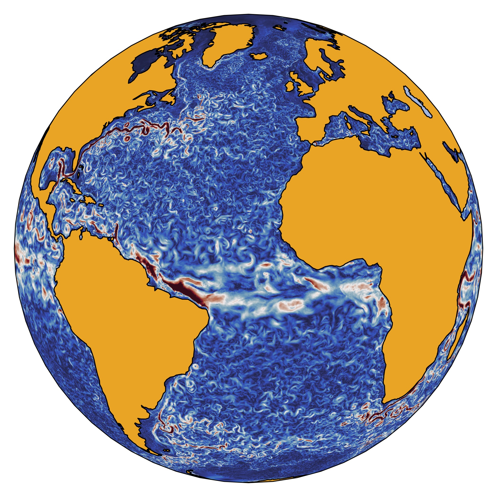

## Arunraj K. Soman 👋
:earth_asia: | Spatial Data scientist | :ocean: Oceanographer
I am a Data Scientist with expertise in climate data analysis, specializing in satellite remote sensing and oceanography. I'm passionate about using data-driven approaches with Python and machine learning to solve real-world challenges.

<!--  -->

<!--
**arunrajks/arunrajks** is a ✨ _special_ ✨ repository because its `README.md` (this file) appears on your GitHub profile.

Here are some ideas to get you started:

- 🔭 I’m currently working on ...
- 🌱 I’m currently learning ...
- 👯 I’m looking to collaborate on ...
- 🤔 I’m looking for help with ...
- 💬 Ask me about ...
- 📫 How to reach me: ...
- 😄 Pronouns: ...
- ⚡ Fun fact: ...
-->
